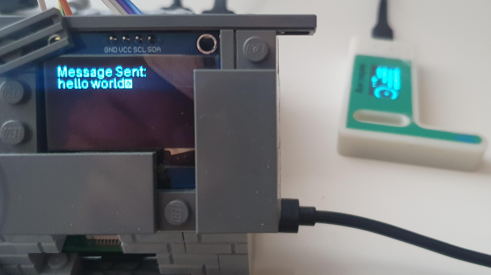
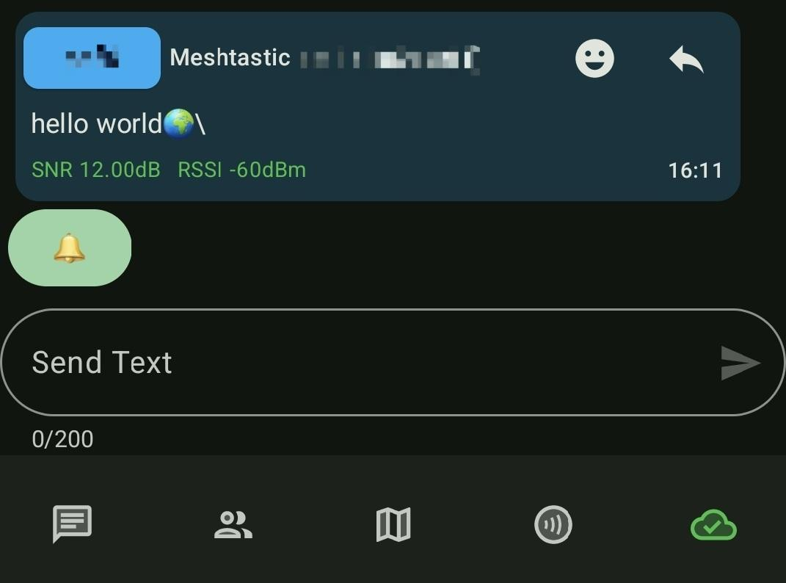

# rpi-meshtastic

```
python3 -m venv venv
source venv/bin/activate

pip3 install meshtastic
deactivate

chmod +x run_meshtastic.sh


./run_meshtastic.sh

```

### Screenshots

Send the message via rpi


What oled shows



What you see in the app (different node connected to your phone)


